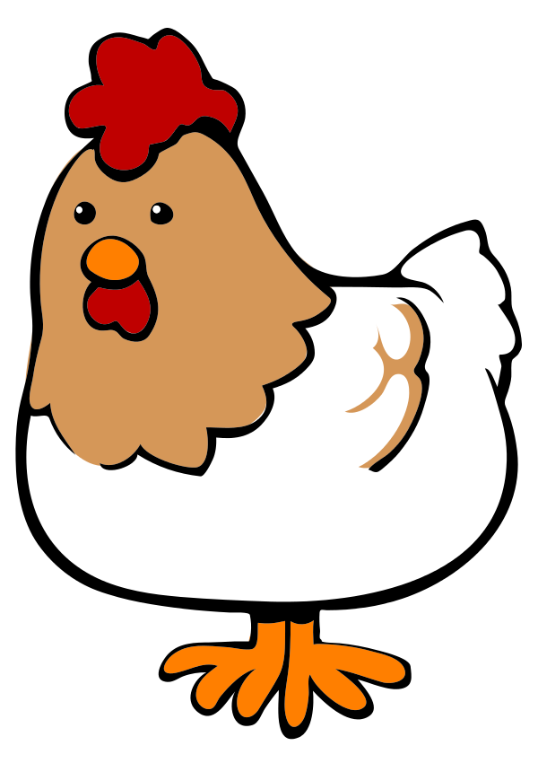

```{r, out.width = "125px", echo=FALSE, fig.align='center'}

```


```{r setup, include=FALSE}
knitr::opts_chunk$set(echo = TRUE)
```


## Data Import 

1. Download chicken.csv to your working directory.  Make sure to set your working directory appropriately!  This dataset was created by modifying the R built-in dataset chickwts.


2. Import the chicken.csv data into R.  Store it in a data.frame named ch_df and print out the entire ch_df to the screen.  

```{r}
ch_df <- read.csv('chicken.csv')
head(ch_df)
```

## Clean Missing Values

There are some missing values in this dataset.  Unfortunately they are represented in a number of different ways.  

3. Clean up this dataset by doing the following:
* Calculate how many elements in the original ch_df are recognized as NA by R.
* Change all of the missing elements to NA in ch_df.
* You do NOT have to fill in the missing values.  Just leave them as NA.
```{r}
library(tidyverse)
library(dplyr)
```

```{r}
ch_df <- as_tibble(ch_df)
sum(is.na(ch_df))
```


```{r}
ch_df[is.na(ch_df) == TRUE] <- "NA"
sum(is.na(ch_df))
ch_df$feed
ch_df$weight
```
```{r}
ch_df[ch_df == 'N/A' | ch_df == "-" | ch_df == "na" | ch_df == '?'| ch_df == ""] <- "NA"
ch_df$feed
ch_df$weight
```


Now that the dataset is clean, let's see what percentage of our data is missing.

4. Calculate the percentage of missing data from:
. The weight column
. The feed column
. The entire dataset.  

Print out each result


```{r}
perc <- function(x,y) {
  per <- (sum(x) / sum(y)) * 100 
  return(per)
}
```


```{r}
ch_df_f_na <- ch_df$feed=="NA"
ch_df_f <- ch_df$feed !="NA"
ch_df_w_na <- ch_df$weight=="NA"
ch_df_w <- ch_df$weight !="NA"
ch_df_all_na <- ch_df=="NA"
ch_df_all <- ch_df!="NA"
perc_f <- perc(ch_df_f_na, ch_df_f)
perc_w <- perc(ch_df_w_na, ch_df_w)
perc_all <- perc(ch_df_all_na, ch_df_all)
print("Percentage of missing values in column 'feed' : ")
print(perc_f)
print("Percentage of missing values in column 'weight' : ")
print(perc_w)
print("Percentage of missing values in dataset : ")
print(perc_all)
```

**EXTRA CREDIT (Optional)**: Figure out how to create these print statements so that the name and percentage number are not hard-coded into the statement.  In other words, so that the name and percentage number are read in dynamically (for example, from a variable, from a function call, etc.) instead of just written in the statement.  

```{r}
stri_printf("[Percentage is ]", perc_all)
```

## Data Investigation

5. Group the data by feed and find the mean and median weight for each group.  Your result should be a new data frame with the group means in a column named weight_mean and the group medians in a column named weight_median.  Save this new data frame; you can name the data frame as you wish.  (Remember that variable names should be somewhat descriptive of what they contain.)

```{r}
feed_summary <- ch_df %>% 
  group_by(feed) %>%
  sumamrise(
    mean_feed = mean(feed),
    median_feed = median(feed)
  )
  
```

6. Find the feed that has the maximum median chicken weight.

```{r}
# fill in your code here
```

7. Create a quick histogram of the weight from the original data frame.

```{r}
# fill in your code here
```

8. Create a box plot with feed type as the X axis.

```{r}
# fill in your code here
```

9. What do these graphs tell you?  Does the box plot confirm your median calculations? If yes, how so?  Are there any outliers displayed in either graph?  Confirm this using the five number summary for specific feed types and the IQR.

```{r}
# fill in your code here
```


